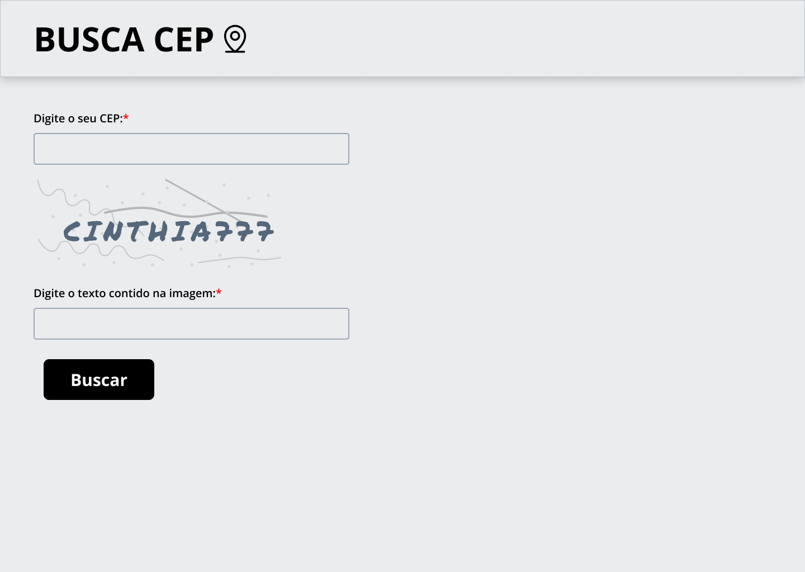

# Busca CEP
``` 
✨ Este projeto foi desenvolvido com o objetivo de aplicar meus conhecimentos em React, TypeScript e SCSS.
``` 



## Experiências Práticas
Ao trabalhar neste projeto, pude experimentar na prática o uso de hooks como useState, useEffect, useNavigate e useParams, além de implementar rotas com React Router, utilizar tipagens com TypeScript e estilizar componentes com SCSS.

## Organização do Projeto
Organizei a estrutura de pastas de forma a facilitar a manutenção e a reutilização dos componentes React.

## Reflexão sobre o Desenvolvimento
Como estou começando agora a utilizar React, notei que o desenvolvimento foi um pouco mais lento em comparação ao uso de HTML, CSS e JavaScript puro. No entanto, entendo que para projetos maiores, esse tipo de framework oferece grandes vantagens na reutilização de código. Pretendo continuar desenvolvendo outros projetos com React para aprimorar meus conhecimentos e aumentar a eficiência no desenvolvimento.